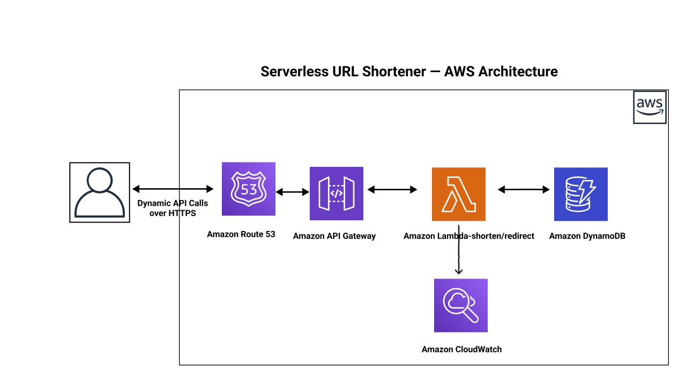

# Serverless URL Shortener

A simple URL shortener built on AWS using API Gateway, Lambda, DynamoDB, IAM, and CloudWatch.

The project accepts a long URL, stores it in DynamoDB with a generated short code, and redirects users to the original URL when they visit the short link.



## Features

- Create short URLs from long URLs
- Redirect short URLs using HTTP `301`
- Store URL mappings in DynamoDB
- Track basic click counts
- Use IAM least-privilege access for DynamoDB operations
- Log Lambda execution through CloudWatch

## Tech Stack

| Service / Tool | Purpose |
| --- | --- |
| AWS Lambda | Runs the URL shortening and redirect logic |
| Amazon DynamoDB | Stores `shortCode`, `longUrl`, `createdAt`, and `clicks` |
| Amazon API Gateway | Exposes public HTTP endpoints |
| IAM | Controls Lambda permissions to DynamoDB |
| CloudWatch | Stores Lambda logs |
| Python | Lambda function runtime |

## Repository Structure

```text
.
├── architecture.jpeg      # Architecture diagram
├── dynamo-policy.json     # IAM policy for DynamoDB access
├── redirect.py            # Lambda function for redirecting short URLs
├── shorten.py             # Lambda function for creating short URLs
├── test-shorten.json      # Sample Lambda test payload
└── README.md              # Project documentation
```

## Architecture

```text
Client
  |
  v
API Gateway
  |
  +--> shorten Lambda  --> DynamoDB
  |
  +--> redirect Lambda --> DynamoDB --> HTTP 301 redirect
```

### Request Flow

1. A client sends a long URL to the shorten endpoint.
2. API Gateway invokes the `shorten.py` Lambda function.
3. Lambda generates a 6-character short code.
4. The mapping is saved in DynamoDB.
5. When a user opens the short URL, API Gateway invokes `redirect.py`.
6. Lambda retrieves the original URL from DynamoDB.
7. Lambda returns an HTTP `301` redirect with the original URL in the `Location` header.

## DynamoDB Table Design

Table name used in the Lambda functions:

```text
url-shortener
```

Primary key:

| Attribute | Type | Description |
| --- | --- | --- |
| `shortCode` | String | Unique code used in the short URL |

Stored item example:

```json
{
  "shortCode": "rv0phj",
  "longUrl": "https://www.google.com",
  "createdAt": "2026-04-20T10:30:00",
  "clicks": 0
}
```

## API Endpoints

The exact API Gateway URL depends on your AWS deployment.

### Create Short URL

```http
POST /shorten
Content-Type: application/json
```

Request body:

```json
{
  "longUrl": "https://www.google.com"
}
```

Example response:

```json
{
  "shortCode": "rv0phj",
  "shortUrl": "https://short.ly/rv0phj",
  "longUrl": "https://www.google.com"
}
```

### Redirect Short URL

```http
GET /{shortCode}
```

Successful response:

```http
HTTP/1.1 301 Moved Permanently
Location: https://www.google.com
```

If the short code is not found:

```json
{
  "error": "Short URL not found"
}
```

## Lambda Functions

### `shorten.py`

Responsible for creating short URLs.

Main steps:

1. Read `longUrl` from the request body.
2. Generate a random 6-character short code.
3. Store the mapping in DynamoDB.
4. Return the generated short URL details.

Required DynamoDB permission:

```text
dynamodb:PutItem
```

### `redirect.py`

Responsible for redirecting users.

Main steps:

1. Read `shortCode` from the path parameter.
2. Fetch the matching item from DynamoDB.
3. Return `404` if the short code does not exist.
4. Increment the click count.
5. Return an HTTP `301` redirect.

Required DynamoDB permissions:

```text
dynamodb:GetItem
dynamodb:UpdateItem
```

## IAM Policy

The included `dynamo-policy.json` grants Lambda access to only the DynamoDB actions required by this project:

```json
[
  "dynamodb:PutItem",
  "dynamodb:GetItem",
  "dynamodb:UpdateItem"
]
```

Update the DynamoDB table ARN in `dynamo-policy.json` if you deploy this project in a different AWS account, region, or table name.

## Deployment Notes

This repository contains the Lambda source code and IAM policy. The AWS resources can be created manually from the AWS Console or automated later with infrastructure as code.

Basic deployment order:

1. Create a DynamoDB table named `url-shortener` with `shortCode` as the partition key.
2. Create an IAM role for the Lambda functions.
3. Attach the DynamoDB policy from `dynamo-policy.json`.
4. Create two Python Lambda functions:
   - `shorten.py`
   - `redirect.py`
5. Connect both Lambda functions to API Gateway routes.
6. Test the shorten endpoint with `test-shorten.json`.
7. Open a generated short URL and confirm it returns a `301` redirect.

## Local Files Not Committed

Generated deployment packages and output files are ignored by Git:

```text
*.zip
*-output.json
output.json
```

These files can be recreated when packaging or testing the Lambda functions.

